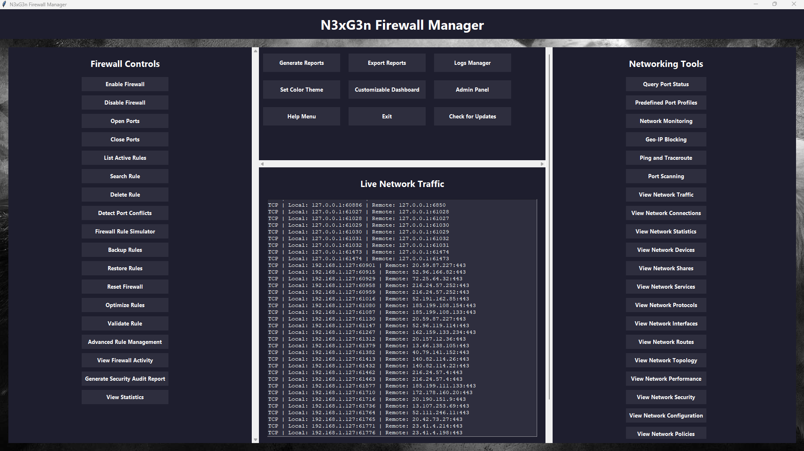

# N3xG3n Firewall Manager

A comprehensive tool for managing Windows Firewall rules with an intuitive graphical interface.

## Table of Contents
- [Features](#features)
- [Installation](#installation)
  - [Prerequisites](#prerequisites)
  - [Option 1: Download Executable](#option-1-download-executable)
  - [Option 2: Run from Source](#option-2-run-from-source)
- [Usage](#usage)
  - [Open/Close Ports](#openclose-ports)
  - [Manage Rules](#manage-rules)
  - [Backup/Restore](#backuprestore)
- [Building from Source](#building-from-source)
- [Project Structure](#project-structure)
- [Contributing](#contributing)
- [License](#license)
- [Contact](#contact)

*   *Main Tab Interface*


## Features

### Port Management
- Open specific ports or port ranges for inbound traffic
- Close specific ports to block unwanted connections

### Rule Management
- Create custom firewall rules
- View existing firewall rules
- Enable/disable firewall rules
- Delete firewall rules

### Security Profiles
- Configure Domain, Private, and Public network profiles
- Apply predefined security templates

### Network Management
- Monitor active connections
- View network statistics

### Application Control
- Allow/block specific applications through the firewall
- Manage application rules

### Additional Tools
- Back up and restore firewall configurations
- Import/Export rules
- Log viewer for firewall events

## Installation

### Prerequisites
- Windows 10/11
- Python 3.10+ (for running from source)
- Administrative privileges

### Option 1: Download Executable
1. Download the latest release from the [Releases](https://github.com/Digital-Synergy2024/Firewall_Manger2.0/releases) page.
2. Run `N3xG3n_FireWall_Manager.exe` (requires administrative privileges).

### Option 2: Run from Source
1. Clone the repository:
   ```
   git clone https://github.com/Digital-Synergy2024/Firewall_Manger2.0.git
   cd Firewall_Manger2.0
   ```
2. Install dependencies (if any):
   ```
   pip install -r requirements.txt
   ```
3. Run the application:
   ```
   python main.py
   ```
   Or use the admin batch file:
   ```
   run_manager_as_admin.bat
   ```

## Usage

### Open/Close Ports
1. Enter port number or range.
2. Select protocol (TCP/UDP).
3. Click the corresponding action button.

### Manage Rules
1. Create rules with specific conditions.
2. View and modify existing rules.

### Backup/Restore
1. Create backups of your firewall configuration.
2. Restore previous configurations when needed.

For detailed instructions on each feature, refer to the in-app help menu.

## Building from Source

To build the executable:

1. Install PyInstaller:
   ```
   pip install pyinstaller
   ```
2. Build the executable:
   ```
   pyinstaller N3xG3n_FireWall_Manager.spec
   ```

The output will be located in the `dist` directory.

## Project Structure

- `main.py` - Application entry point
- `ui.py` - User interface implementation
- `firewall.py` - Firewall management operations
- `network.py` - Network utilities
- `utils.py` - Helper functions

## Contributing

Contributions are welcome! Please feel free to submit a Pull Request.

1. Fork the repository.
2. Create your feature branch (`git checkout -b feature/AmazingFeature`).
3. Commit your changes (`git commit -m 'Add some AmazingFeature'`).
4. Push to the branch (`git push origin feature/AmazingFeature`).
5. Open a Pull Request.

## License

This project is licensed under the terms of the license included in the [`LICENSE`](LICENSE) file.

## Contact

Developer - jarrodz@digital-synergy.org

Project Link: [https://github.com/Digital-Synergy2024/Firewall_Manger2.0](https://github.com/Digital-Synergy2024/Firewall_Manger2.0)